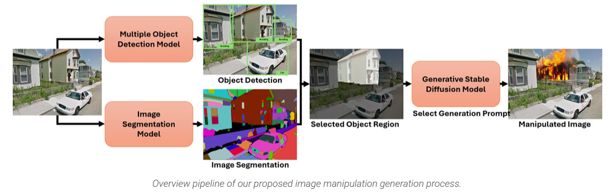
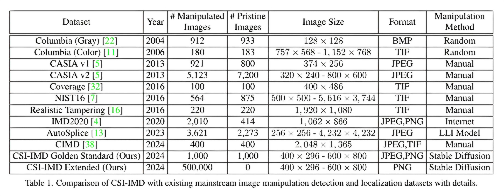
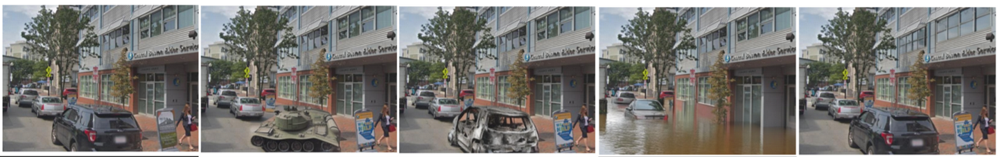

# CSI-IMD: A Semantically Significant Image Manipulation Dataset

Yuwei Chen<sup>1</sup>, Ming-Ching Chang<sup>1</sup>, Mattias Kirchner<sup>2</sup>, Zhenfei Zhang<sup>1</sup>, Xin Li<sup>1</sup>, Arslan Basharat<sup>2</sup>, Anthony Hoogs<sup>2</sup> </br>
University at Albany, Albany, NY, USA<sup>1</sup> </br>
Kitware Inc, Clifton Park, NY, USA<sup>2</sup>
</br>

We introduce the Characterization of Semantic Impact for IMD (CSI-IMD) dataset (Accepted to WACV 2025), which focuses on localizing and evaluating the semantic impact of image manipulations to counter advanced generative techniques. Our evaluation of 10 state-of-the-art IMD and localization methods on CSI-IMD reveals that existing state of the art methods do not adapt well to unseen manipulation signatures. Unlike existing datasets, CSI-IMD provides additional semantically focused annotations beyond traditional manipulation masks, aiding in the development of new defensive strategies. The proposed dataset contains two sets. A gold standard set containing 1,000 manually filtered manipulated images containing all 6 annotation types. A expanded set that contains 500,000 semantically impactful manipulated imaged  generated through the automated pipeline below. Details of both the gold standard set and expanded set can be found in the summary section.

Paper: (Link to be added after WACV 2025)



## Dataset Summary 

**Gold Standard Set:** Contains 1,000 manually filtered manipulated images generated by stable diffusion and 1,000 pristine images gathered from the [GSV Cities](https://github.com/amaralibey/gsv-cities) and [Road Vehicle Image](https://www.kaggle.com/datasets/ashfakyeafi/road-vehicle-images-dataset) Dataset. All image manipulation localization and semantic significance ranking experiments were done on the gold standard set.  

 
 **Gold Standard Set Annotations:** </br>
		- **isManipulated Binary Flag:** Indicates if the image is manipulated.</br>
		- **Manipulation Object Class:** The object class of the spliced manipulation.</br>
		- **Manipulation Mask:** A pixel-level mask showing all pixels that have been manipulated.</br>
		- **Semantically Relevant Manipulation Mask:** A pixel-level mask highlighting all pixels related to the manipulation object class (ex. Burning Building).</br>
		- **Semantic Significance Score:** A score from 0 to 1 measuring the extent of semantic change in the image scene.</br>
		- **Semantic Significance Ranking:** A score from 1 to 5 indicating the manipulation’s SS for each image scene. </br>
</br>
	**Semantic Significance Categories:** Low, Medium, High
</br>

**Expanded Set:** Contains 500,000 automated manipulated images generated using the stable diffusion generation pipeline above. This dataset's purpose is to give the community a large scale image manipulation dataset that contains semantically significant manipulations. Our goal is to inspire future research in analyzing image manipulations under a semantic threat assessment mindset.

**Expanded Set Manipulation Types**:</br>
	- Mudslide (100,000 Samples)</br>
	- Flood (100,000 Samples)</br>
	- Military Tank (100,000 Samples)</br>
	- Destroyed Car (100,000 Samples)</br>
	- Police Car (100,000 Samples)</br>
 
**Expanded Set Annotations:** </br>
	- **isManipulated Binary Flag:** Indicates if the image is manipulated.</br>
	- **Manipulation Object Class:** The object class of the spliced manipulation.</br>
	- **Manipulation Mask:** A pixel-level mask showing all pixels that have been manipulated.</br>
</br>
## Existing Image Manipulation Localization Datasets

## Image Manipulation Semantic Significance Ranking Task

We propose a new semantically focused image forensics task called the Semantic Significance Ranking task. All participating methods are given manipulated images in groups of five. All five image manipulations are done on the same natural image. This ensure that the only difference between all images in each image group is the image manipulation itself. The image forensics task is to rank these five manipulations based on their semantic significance. Semantic Significance is defined as the semantic impact a given image manipulation has on the image scene from a semantics perspective.
## Dataset Download
The CSI-IMD dataset can be downloaded through the links below. If you have any questions, please send an email to [csiimd.dataset@gmail.com].

**Gold Standard Set:**</br>
Manipulated Images ([Link]([https://drive.google.com/file/d/1u1BZU6oaT_ffdL0RCzSTc51eTxmQ-NZS/view?usp=sharing](https://drive.google.com/drive/folders/1pgxykiWHOWtw6sP5DNi52nxV9ur3to9N?usp=sharing)))</br>
	
**Expanded Set:** ([Link]([https://drive.google.com/file/d/1u1BZU6oaT_ffdL0RCzSTc51eTxmQ-NZS/view?usp=sharing](https://drive.google.com/file/d/1e4CAEjte3K-JjQgIq5Tihu9va3aEO1h8/view?usp=sharing)))</br>
## License and Citation
The CSI-IMD dataset is released only for academic research. Researchers from educational institutes are allowed to use this dataset freely for noncommercial purposes.

If you use this dataset, please cite our paper below:
```
@inproceedings{csiimd,
  title={A Semantically Impactful Image Manipulation Dataset: Characterizing Image Manipulations using Semantic Significance},
  author={Yuwei Chen, Ming-Ching Chang, Mattias Kirchner, Zhenfei Zhang, Xin Li, Arslan Basharat, Anthony Hoogs},
  booktitle={IEEE/CVF Winter Conference on Applications of Computer Vision (WACV)},
  year={2025}
}
